# Kyokai Spec Compiler Traceability

This document tracks the relationship between the extracted Kyokai specification, inherited Austral compiler evidence, future Kyokai implementation work, and conformance tests.

The Kyokai specification has now been extracted through Phase 15. The current normative source tree is `src/language/`, `src/toolchain/`, `src/stdlib/`, and `src/appendices/`. Rationale chapters in `src/rationale/` are non-normative explanation. The old inherited Austral chapter files have been removed from the active build after replacement by Kyokai chapters; `src/appendices/c-austral-differences.md` records where the source material moved.

The inherited compiler evidence below is still useful, but it must not be read as proof that the current compiler implements Kyokai. Rows marked `Legacy Verified` describe inherited Austral behavior that was checked against inherited Austral source or tests. A Kyokai row becomes `Verified` only after the extracted Kyokai rule is checked against current Kyokai compiler/source paths and tests.

## Legend

| Status | Meaning |
|--------|---------|
| **Spec Extracted** | Kyokai rule text exists in the extracted specification, but implementation and conformance evidence are not claimed here. |
| **Kyokai Pending** | A Kyokai implementation/conformance row still needs to be written or checked. |
| **Verified** | Extracted Kyokai claim matches current Kyokai compiler source and tests cited in the row. |
| **Legacy Verified** | Inherited Austral claim matched inherited Austral compiler evidence. Useful migration evidence, not Kyokai implementation status. |
| **Reviewed** | Non-normative or spot-check only; not a line-by-line compiler proof. |
| **Informative** | EBNF, rationale, prose, or migration notes used as explanation only. |
| **N/A** | No compiler evidence is applicable for the row. |
| **Defect** | Source evidence contains an apparent bug or internally inconsistent implementation. |
| **Gap** | Open item: spec, compiler, trace, or tests are incomplete. |

Columns: **Spec** | **Claim (summary)** | **Compiler evidence** | **Tests** | **Status**

## Current Kyokai build chapter order

`Makefile` now builds the extracted Kyokai specification in this order:

1. [spec.md](spec.md)
2. [src/language/00-introduction.md](src/language/00-introduction.md)
3. [src/language/01-goals-and-non-goals.md](src/language/01-goals-and-non-goals.md)
4. [src/language/02-lexical-syntax.md](src/language/02-lexical-syntax.md)
5. [src/language/03-grammar.md](src/language/03-grammar.md)
6. [src/language/04-modules-and-visibility.md](src/language/04-modules-and-visibility.md)
7. [src/language/05-declarations.md](src/language/05-declarations.md)
8. [src/language/06-type-system.md](src/language/06-type-system.md)
9. [src/language/07-generics-and-typeclasses.md](src/language/07-generics-and-typeclasses.md)
10. [src/language/08-patterns.md](src/language/08-patterns.md)
11. [src/language/09-expressions-and-evaluation.md](src/language/09-expressions-and-evaluation.md)
12. [src/language/10-statements-and-control-flow.md](src/language/10-statements-and-control-flow.md)
13. [src/language/11-linearity-borrowing-and-regions.md](src/language/11-linearity-borrowing-and-regions.md)
14. [src/language/12-implicit-completions-and-elaboration.md](src/language/12-implicit-completions-and-elaboration.md)
15. [src/language/13-contracts-and-runtime-failure.md](src/language/13-contracts-and-runtime-failure.md)
16. [src/language/14-capabilities-and-authority.md](src/language/14-capabilities-and-authority.md)
17. [src/language/15-concurrency.md](src/language/15-concurrency.md)
18. [src/language/16-unsafe-ffi-and-abi.md](src/language/16-unsafe-ffi-and-abi.md)
19. [src/language/17-memory-layout-and-backend-contract.md](src/language/17-memory-layout-and-backend-contract.md)
20. [src/language/18-built-ins.md](src/language/18-built-ins.md)
21. [src/language/19-examples.md](src/language/19-examples.md)
22. [src/toolchain/00-toolchain-overview.md](src/toolchain/00-toolchain-overview.md)
23. [src/toolchain/01-manifest-package-workspace.md](src/toolchain/01-manifest-package-workspace.md)
24. [src/toolchain/02-module-resolution-and-koi.md](src/toolchain/02-module-resolution-and-koi.md)
25. [src/toolchain/03-cli.md](src/toolchain/03-cli.md)
26. [src/toolchain/04-build-profiles-targets-linking.md](src/toolchain/04-build-profiles-targets-linking.md)
27. [src/toolchain/05-diagnostics.md](src/toolchain/05-diagnostics.md)
28. [src/toolchain/06-formatter.md](src/toolchain/06-formatter.md)
29. [src/toolchain/07-testing-coverage-bench.md](src/toolchain/07-testing-coverage-bench.md)
30. [src/toolchain/08-docs-lsp-audit.md](src/toolchain/08-docs-lsp-audit.md)
31. [src/toolchain/09-reproducibility-incremental-builds.md](src/toolchain/09-reproducibility-incremental-builds.md)
32. [src/toolchain/10-package-index-semver-releases-ci.md](src/toolchain/10-package-index-semver-releases-ci.md)
33. [src/toolchain/11-build-generation-and-playground.md](src/toolchain/11-build-generation-and-playground.md)
34. [src/stdlib/00-stdlib-overview.md](src/stdlib/00-stdlib-overview.md)
35. [src/stdlib/01-admission-contracts.md](src/stdlib/01-admission-contracts.md)
36. [src/stdlib/02-core-result-optional-display-error.md](src/stdlib/02-core-result-optional-display-error.md)
37. [src/stdlib/03-allocators-and-memory-containers.md](src/stdlib/03-allocators-and-memory-containers.md)
38. [src/stdlib/04-text-bytes-paths-and-strings.md](src/stdlib/04-text-bytes-paths-and-strings.md)
39. [src/stdlib/05-collections.md](src/stdlib/05-collections.md)
40. [src/stdlib/06-iterators-and-generators.md](src/stdlib/06-iterators-and-generators.md)
41. [src/stdlib/07-math-and-numerics.md](src/stdlib/07-math-and-numerics.md)
42. [src/stdlib/08-io-files-env-process-time-random.md](src/stdlib/08-io-files-env-process-time-random.md)
43. [src/stdlib/09-concurrency-primitives.md](src/stdlib/09-concurrency-primitives.md)
44. [src/stdlib/10-crypto-policy.md](src/stdlib/10-crypto-policy.md)
45. [src/stdlib/11-transitional-ffi-tracking.md](src/stdlib/11-transitional-ffi-tracking.md)
46. [src/rationale/00-rationale-index.md](src/rationale/00-rationale-index.md)
47. [src/rationale/01-language-design.md](src/rationale/01-language-design.md)
48. [src/rationale/02-syntax.md](src/rationale/02-syntax.md)
49. [src/rationale/03-error-handling-and-tpoe.md](src/rationale/03-error-handling-and-tpoe.md)
50. [src/rationale/04-linear-resources.md](src/rationale/04-linear-resources.md)
51. [src/rationale/05-capabilities.md](src/rationale/05-capabilities.md)
52. [src/rationale/06-concurrency.md](src/rationale/06-concurrency.md)
53. [src/rationale/07-stdlib-philosophy.md](src/rationale/07-stdlib-philosophy.md)
54. [src/rationale/08-toolchain-philosophy.md](src/rationale/08-toolchain-philosophy.md)
55. [src/appendices/a-license.md](src/appendices/a-license.md)
56. [src/appendices/b-decision-traceability.md](src/appendices/b-decision-traceability.md)
57. [src/appendices/c-austral-differences.md](src/appendices/c-austral-differences.md)
58. [src/appendices/d-formalization-roadmap.md](src/appendices/d-formalization-roadmap.md)
59. [src/appendix-a.md](src/appendix-a.md)

## Current Kyokai extraction summary

| Spec Family | Current Spec Locations | Compiler Evidence | Tests | Status |
| --- | --- | --- | --- | --- |
| Language specification | `src/language/00-introduction.md` through `src/language/19-examples.md` | Inherited Austral compiler still needs rule-by-rule Kyokai audit. | Planned conformance suites. | Spec Extracted |
| Toolchain specification | `src/toolchain/00-toolchain-overview.md` through `src/toolchain/11-build-generation-and-playground.md` | Current inherited CLI/build behavior is not yet a Kyokai toolchain implementation claim. | Planned command, manifest, artifact, diagnostic, formatter, docs, LSP, audit, reproducibility, and release tests. | Spec Extracted |
| Standard-library contract specification | `src/stdlib/00-stdlib-overview.md` through `src/stdlib/11-transitional-ffi-tracking.md` | Inherited Austral stdlib is reference evidence only; Kyokai `Kyokai.*` APIs still need admission and implementation. | Planned stdlib admission, edge-case, property/fuzz, oracle/vector, and platform tests. | Spec Extracted |
| Rationale | `src/rationale/00-rationale-index.md` through `src/rationale/08-toolchain-philosophy.md` | Compiler evidence not applicable except where rationale points to normative chapters. | N/A. | Reviewed |
| Appendices | `src/appendices/a-license.md` through `src/appendices/d-formalization-roadmap.md` | Traceability and roadmap documents, not compiler implementation. | N/A except future proof artifact checks. | Reviewed |
| Austral source material and GFDL text | Old inherited chapter files were replaced by Kyokai chapters; `src/appendix-a.md` carries the full GFDL text. | Source provenance is recorded in `src/appendices/a-license.md` and `src/appendices/c-austral-differences.md`. | Informative |

## Current inherited compiler pipeline evidence

The inherited pipeline below is useful evidence for Kyokai compiler planning. Paths should be checked against the current Kyokai `../lib/` tree during extraction:

```mermaid
flowchart LR
  parseCombine[parse_and_combine]
  return0[check_ends_in_return]
  desugar[DesugaringPass.desugar]
  extract[ExtractionPass.extract]
  augment[TypingPass.augment_module]
  linear[LinearityCheck.check_module_linearity]
  bodies[BodyExtractionPass.extract_bodies]
  mono[Monomorphize.monomorphize]
  codegen[CodeGen.gen_module]
  render[CRenderer.render_unit]
  parseCombine --> return0 --> desugar --> extract --> augment --> linear --> bodies --> mono --> codegen --> render
```

(`parse_and_combine` in [`Compiler.ml`](../lib/Compiler.ml) parses interface/body, appends pervasive imports, and runs `CombiningPass.combine`.)

## Phase 1 - Lexer / parser / CST

| Spec | Claim | Compiler evidence | Tests | Status |
|------|--------|---------------------|-------|--------|
| 2.syntax section modules | Module interface ends `end module.`; body ends `end module body.` | `Parser.mly`: `module_int` / `module_body` (`END MODULE PERIOD`, `END MODULE BODY PERIOD`) | Parser tests | Legacy Verified |
| 2.syntax section comments | Line comments `--` ... newline or EOF | `Lexer.mll`: `comment` rule | - | Legacy Verified |
| 2.syntax section literals | Decimal / hex `#x` / bin `#b` / oct `#o`; `'` digit separators; float `E`/`e` | `Lexer.mll`: `dec_constant`, `hex_constant`, ...; `Parser.mly`: `int_constant` / `float_constant` | `ExpressionParserTest.ml` | Legacy Verified |
| 2.syntax section literals | String / triple-string; char escapes limited | `Lexer.mll`: `read_string`, `read_triple_string`, `char_constant` | - | Legacy Verified |
| 2.syntax section imports | Empty import lists parse | `Parser.mly`: `separated_list(COMMA, imported_symbol)` in `import_stmt` | - | Legacy Verified |
| 2.syntax section functions | Empty function body parses as empty block | `Parser.mly`: `function_def` uses `body=block?` | FFI examples | Legacy Verified |
| 2.syntax section module body | Module-level pragmas appear before imports and `module body` | `Parser.mly`: `docstringopt pragmas=pragma* imports=import_stmt* MODULE BODY` | `test-programs/*` unsafe modules | Legacy Verified |
| 2.syntax EBNF | Not every production maps 1:1 to Menhir | Informative abstraction | - | Informative |

### Phase 1 detail: docstrings

| Spec | Claim | Compiler evidence | Status |
|------|--------|---------------------|--------|
| 2.syntax section comments | Docstrings are `TRIPLE_STRING_CONSTANT` at module head | `Parser.mly`: `module_int` / `module_body` use `docstringopt`; `Lexer.mll` triple-string | Legacy Verified |
| 5-7 syntax | Keywords, `=>` named args, `@embed`, `sizeof(T)` | `Lexer.mll` tokens; `Parser.mly` `named_arg`, `intrinsic`, `SIZEOF` | `StatementParserTest.ml`, `ExpressionParserTest.ml` | Legacy Verified |
| 6.statements | `else if` tokenization | `Lexer.mll`: `ELSE_IF` from `"else" whitespace+ "if"` | - | Legacy Verified |
| 6.statements | `var { ... } := expr;` destructure accepted | `Parser.mly`: `let_destructure` uses `var_mutability` | - | Legacy Verified |
| 6.statements | `for` loop bounds are Index-compatible and emitted as inclusive `<=` | `TypingPass.ml`: `is_compatible_with_index_type`; `CodeGen.ml` / `CRenderer.ml`: `CFor` | `001-trivial/004-for-loop` | Legacy Verified |
| 7.expressions | `@embed(ty, "fmt", ...)` | `Parser.mly`: `intrinsic` | - | Legacy Verified |

## Phase 2 - Types, typeclasses, builtins

| Spec | Claim | Compiler evidence | Tests | Status |
|------|--------|---------------------|-------|--------|
| 4.types | Built-in scalars `Nat*` / `Int*` / `Index` / `ByteSize` / floats | `TypeParser.ml`: `parse_built_in_type` | Type tests | Legacy Verified |
| 4.types | `Static` region; string type `Span[Nat8, Static]` | `TypeParser.ml` `Static`; `Type.ml` `string_type`; `TastUtil.ml` `TStringConstant` | - | Legacy Verified |
| 4.types | Borrow `&[T,R]`, span `Span[T,R]` not nominal Reference | `Parser.mly` `typespec`; `TypeParser.ml` `QReadRef` / `QSpan` | - | Legacy Verified |
| 4.types | Universe markers `Free`/`Linear`/`Type`/`Region` | `Parser.mly` `universe`; `Type.ml` `universe` | - | Legacy Verified |
| 4a | Instance orphan / overlap / shape rules | `TypeClasses.ml` (`check_instance_orphan_rules`, `overlapping_instances`, `check_instance_argument_has_right_shape`, ...) | - | Legacy Verified |
| 7b | Pervasive imports injected into every non-pervasive module | `BuiltIn.ml` `pervasive_imports`; `Compiler.ml` `append_import_to_interface` / `append_import_to_body` | - | Legacy Verified |
| 7c | `Austral.Memory` API signatures | `builtin/Memory.aui` | `test-programs/suites/016-*`, `017-*` | Legacy Verified |
| 7c | `Austral.Memory` runtime bodies: zero-count allocation abort, direct null return on allocator failure, span length `(final - start) + 1` | `builtin/Memory.aum`; `prelude.c` `au_calloc` / `au_realloc` | `test-programs/suites/016-*`, `017-*` | Legacy Verified |
| 7d | `Austral.Pervasive` API | `builtin/Pervasive.aui` / `Pervasive.aum` | `test-programs/suites/008-*` | Legacy Verified |
| 7d | `Remainder` method `rem` | `Pervasive.aui` | - | Legacy Verified |
| 7d | Duplicate malformed `instance Remainder(Nat8)` body exists before `instance Remainder(Int8)` | `builtin/Pervasive.aum` around Remainder instances | - | Defect |

## Phase 3 - Typechecking (expressions + statements)

| Spec | Claim | Compiler evidence | Tests | Status |
|------|--------|---------------------|-------|--------|
| 7.expressions | Integer literal default type `Int32` | `TastUtil.ml` `get_type` `TIntConstant` -> `Integer (Signed, Width32)` | - | Legacy Verified |
| 7.expressions | `sizeof(T)` type `ByteSize` | `TastUtil.ml` `TSizeOf` -> `WidthByteSize` | - | Legacy Verified |
| 7.expressions | Casts: literals, write->read ref, polymorphic return, general match | `TypeCheckExpr.ml` `augment_typecast` | - | Legacy Verified |
| 7.expressions | Arithmetic lowers via pervasive trapping ops; accepted numeric type also needs visible `TrappingArithmetic` resolution (`Float32` has no shipped instance) | `TypeCheckExpr.ml` `augment_arithmetic`; `builtin/Pervasive.aui` instances | - | Legacy Verified |
| 7.expressions | Comparisons currently enforce operand type matching but do not call `TypeSystem.is_comparable` | `TypeCheckExpr.ml` `augment_comparison`; unused helper in `TypeSystem.ml` | - | Legacy Verified |
| 6 / 7 | `Foreign_Import` only in `UnsafeModule` | `TypingPass.ml` `augment_decl` / `foreign_in_safe_module` | - | Legacy Verified |
| 7e | `Foreign_Export` does not use the same unsafe-module guard in typing | `TypingPass.ml` `augment_decl` `[ForeignExportPragma _]` branch | `010-functions/004-export-function` | Legacy Verified |
| 3.modules | `Austral.Memory` import forbidden in safe module | `ImportResolution.ml` `import_memory_in_safe_module` | - | Legacy Verified |

## Phase 4 - Linearity + borrows

| Spec | Claim | Compiler evidence | Tests | Status |
|------|--------|---------------------|-------|--------|
| 7a | Linear variable use rules | `LinearityCheck.ml` | `test-programs/suites/007-*`, `015-*` | Legacy Verified |
| 6 / 7 borrow | Borrow statement / desugar; read borrows accepted for free and linear variables; mutable local borrow rejected for immutable locals | `DesugarBorrows.ml`; `Parser.mly` `borrow_stmt`; `TypingPass.ml` `ABorrow` | `007-borrowing/*`, `016-borrow-free` | Legacy Verified |

## Phase 5 - Modules, entrypoint, FFI, C ABI

| Spec | Claim | Compiler evidence | Tests | Status |
|------|--------|---------------------|-------|--------|
| 3.modules | Import syntax; pervasive imports injected at combine | `Parser.mly` `import_stmt`; `Compiler.ml` `append_import_*` + `BuiltIn.ml` | - | Legacy Verified |
| 8.examples | Entrypoint `main` public; 0 or 1 `RootCapability` | `Entrypoint.ml` `check_entrypoint_validity` | Examples in spec | Legacy Verified |
| 7e | Pragmas `Foreign_Import` / `Foreign_Export` / `Unsafe_Module`; exact `External_Name` named argument shape | `CstUtil.ml` `make_pragma` | - | Legacy Verified |
| 7f import | Lowering to `au_*` / `size_t` / spans | `CodeGen.ml` -> `CRepr.ml` / `CRenderer.ml` (C emission path) | `CRendererTest.ml` (where applicable) | Legacy Verified |
| 7f export | Allowed / disallowed export types | `ExportInstantiation.ml` `transform_ty` (rejects `Unit`, refs, spans, `Pointer`, `NamedType`, ...) | - | Legacy Verified |

## Phase 6 - Non-normative chapters

| Spec | Claim | Compiler evidence | Tests | Status |
|------|--------|---------------------|-------|--------|
| 0, 1, 9 | Design goals / style: no compiler cross-check required for normative truth | - | - | Reviewed |
| rationale/* | Mostly motivation; pseudocode flagged in 3.resource-types; `austral` fenced code blocks only in 4.capabilities (module sketches) | Manual review | - | Reviewed |
| appendix-a | GFDL text | N/A | - | N/A |
| 8.examples | Examples pair interface+body where `main` is entry | `Entrypoint.ml` | - | Legacy Verified |

## Phase 7 - `austral/lib/*.ml` ownership checklist

Each file is assigned to a **phase** for coverage closure (helpers are **N/A** unless the spec names them).

| File | Owner phase | Spec touchpoints | Status |
|------|-------------|------------------|--------|
| Lexer.mll | 1 | 2.syntax | Legacy Verified |
| Parser.mly | 1 | 2-7 surface | Legacy Verified |
| ParserInterface.ml | 1 | - | N/A |
| Cst.ml, CstUtil.ml | 1,5 | CST + pragmas | Legacy Verified |
| Type.ml, TypeParser.ml, TypeSystem.ml, TypeMatch.ml, TypeSignature.ml, TypeReplace.ml, TypeStripping.ml, TypeBindings.ml, TypeVarSet.ml, TypeParameter.ml, TypeParameters.ml, TypeErrors.ml | 2 | 4.types, 4a | Legacy Verified |
| Names.ml, Qualifier.ml, Region.ml, RegionMap.ml | 2 | Regions, pretty-print names | Legacy Verified |
| BuiltIn.ml, BuiltIn.mli, BuiltInModules.mli | 2 | 7b-7d | Legacy Verified |
| Env.ml, EnvTypes.ml, EnvUtils.ml, EnvExtras.ml, LexEnv.ml | 2,4,5 | Env / instances | Legacy Verified |
| ImportResolution.ml, Imports.ml | 5 | 3.modules | Legacy Verified |
| CombiningPass.ml, DesugaringPass.ml, DesugarBorrows.ml, DesugarPaths.ml | 1,4 | combine, desugar | Legacy Verified |
| ExtractionPass.ml, BodyExtractionPass.ml, AbstractionPass.ml | 5 | linking | Legacy Verified |
| TypingPass.ml, TypeCheckExpr.ml, TastUtil.ml | 3 | 6,7 | Legacy Verified |
| ReturnCheck.ml | 3 | `check_ends_in_return` | Legacy Verified |
| LinearityCheck.ml | 4 | 7a | Legacy Verified |
| TypeClasses.ml | 2 | 4a | Legacy Verified |
| Monomorphize.ml, MonoType.ml, MonoTypeBindings.ml, MtastUtil.ml | 7 | monomorphize (spec defers codegen detail) | N/A |
| CodeGen.ml, CRepr.ml, CRenderer.ml | 5 | 7f | Legacy Verified |
| ExportInstantiation.ml | 5 | 7f export table | Legacy Verified |
| Entrypoint.ml | 5 | 8.examples, entrypoint | Legacy Verified |
| Compiler.ml | 0 | pipeline | Legacy Verified |
| Stages.ml, Id.ml, Identifier*.ml, Span.ml, SourceContext.ml, Reporter.ml, Error*.ml, Escape.ml, Util.ml, StringSet.ml, ModIdSet.ml, ModuleNameSet.ml, DeclIdSet.ml, Common.ml, Version.ml, HtmlError.ml | mixed | Support / errors | N/A |
| Cli*.ml | CLI | Out of core spec | N/A |
| LiftControlPass.ml | 4 | Control lowering (spec does not detail) | N/A |

## Phase 8 - Legacy convergence / CI

- Run `dune build` / `dune runtest` in `austral/` when OCaml deps (`yojson`, `ounit2`, etc.) are available and `lib/dune` lists `builtInModules` under `modules_without_implementation` if required by the toolchain.
- **Last run (workspace agent):** `dune runtest` failed: missing `ounit2`, missing `yojson` for `austral_core`, and Menhir stanza reports `builtInModules` without implementation - fix local opam/switch before treating CI as green.
- **Installed compiler E2E run (workspace agent):** `AUSTRAL=/home/chris/.nix-profile/bin/austral python3 test-programs/runner.py` in `../austral/` passed every upstream end-to-end test.
- **Spec fence run (workspace agent):** `make check-austral-fences AUSTRAL=/home/chris/.nix-profile/bin/austral` passed: 14 complete Austral fences compiled; 101 fragment fences skipped by design.
- **Spec build run (workspace agent):** `nix-shell -p pandoc texliveSmall --run 'make'` passed and generated `spec.pdf` plus `spec.html`.
- After any Kyokai implementation or conformance edit, update Kyokai rows from **Kyokai Pending** or **Gap** to **Verified** only with a cited current Kyokai source/test path. Do not upgrade `Legacy Verified` rows merely because inherited Austral tests pass.

## Mirror: `austral.github.io/_spec/`

Optional sibling site: replay the same **Phase 1-5** rows against `_spec/*.md`. As of this trace creation, `types.md` / `linearity.md` / `goals.md` / `rationale-capabilities.md` / `austral-memory.md` / `austral-pervasive.md` / `expressions.md` / `statements.md` were aligned with the same compiler anchors.

## Open implementation and conformance gaps after extraction

1. **Kyokai compiler audit**: inherited Austral compiler evidence must be replayed against the extracted Kyokai language chapters before any row becomes `Verified`.
2. **Kyokai conformance suites**: parser, checker, linearity, capability, unsafe/FFI, backend, toolchain, and stdlib tests still need paths and status rows.
3. **Stdlib admission records**: `Kyokai.*` modules need implementation paths, admission records, edge-case tests, oracle/vector tests where relevant, and transitional FFI records.
4. **Toolchain behavior**: `kyokai` CLI, package manager, `.koi`, formatter, docs, LSP, audit, build output/cache layout, and release commands need implementation evidence and tests.
5. **Formal proof**: `src/appendices/d-formalization-roadmap.md` records the proof obligation; the `lambda_K-seq` paper proof is still a future artifact.
