# Kyokai Spec ↔ Compiler Traceability Staging

This document is the traceability staging file for the future Kyokai specification.

 Kyokai spec extraction has not started yet. Most rows below still describe inherited Austral specification material and inherited Austral compiler evidence. Those rows are useful migration evidence, but they are not Kyokai normative claims until the corresponding spec section is rewritten as Kyokai text under this directory.

The purpose of this file is to keep public readers from confusing inherited spec material with completed Kyokai specification work, while preserving the compiler/source evidence that will be useful during extraction.

Every future Kyokai normative claim should eventually have a row here with one of these outcomes:

- evidence in `../lib/`, `../standard/`, `../test/`, or `../test-programs/`
- explicit conformance test path
- explicit `N/A` rationale for prose-only or non-compiler behavior
- explicit gap if the spec or compiler still needs work

## Legend

| Status | Meaning |
|--------|---------|
| **Kyokai Pending** | Kyokai spec text has not been written yet for this row. |
| **Verified** | Claim matches current compiler source and tests where cited. Use this for rewritten Kyokai rows only after checking current Kyokai source. |
| **Legacy Verified** | Inherited Austral claim matched inherited Austral compiler evidence. Useful migration evidence, not Kyokai normative status. |
| **Reviewed** | Non-normative or spot-check only; not a line-by-line compiler proof. |
| **Informative** | EBNF / prose intentionally not isomorphic to the grammar, or retained as explanation only. |
| **N/A** | No normative claim in spec for this compiler surface, or compiler evidence is not applicable. |
| **Defect** | Spec records behavior visible in compiler source, but the source contains an apparent bug or internally inconsistent implementation. |
| **Gap** | Open item: spec, compiler, trace, or tests are incomplete. |

Columns: **Spec** | **Claim (summary)** | **Compiler evidence** | **Tests** | **Status**

During Kyokai extraction, prefer `Kyokai Pending` for rows that have not been rewritten yet. Convert inherited rows to Kyokai `Verified` only after checking the rewritten spec text against current Kyokai source and tests.

## Current inherited chapter order

The current `Makefile` still builds the inherited Austral chapter order. This order is staging/reference material until replaced by the Kyokai spec structure:

1. [spec.md](spec.md) (title/front matter)
2. [src/0.introduction.md](src/0.introduction.md)
3. [src/1.goals.md](src/1.goals.md)
4. [src/rationale/0.rationale.md](src/rationale/0.rationale.md)
5. [src/rationale/1.syntax.md](src/rationale/1.syntax.md)
6. [src/rationale/3.resource-types.md](src/rationale/3.resource-types.md)
7. [src/rationale/2.error-handling.md](src/rationale/2.error-handling.md)
8. [src/rationale/4.capabilities.md](src/rationale/4.capabilities.md)
9. [src/2.syntax.md](src/2.syntax.md)
10. [src/3.modules.md](src/3.modules.md)
11. [src/4.types.md](src/4.types.md)
12. [src/4a.type-classes.md](src/4a.type-classes.md)
13. [src/5.declarations.md](src/5.declarations.md)
14. [src/6.statements.md](src/6.statements.md)
15. [src/7.expressions.md](src/7.expressions.md)
16. [src/7a.linearity.md](src/7a.linearity.md)
17. [src/7b.builtins.md](src/7b.builtins.md)
18. [src/7c.austral-memory.md](src/7c.austral-memory.md)
19. [src/7d.austral-pervasive.md](src/7d.austral-pervasive.md)
20. [src/7e.ffi.md](src/7e.ffi.md)
21. [src/7f.c-ffi.md](src/7f.c-ffi.md)
22. [src/8.examples.md](src/8.examples.md)
23. [src/9.style.md](src/9.style.md)
24. [src/appendix-a.md](src/appendix-a.md)

## Current inherited compiler pipeline evidence

The inherited pipeline below is useful evidence for Kyokai compiler planning. Paths should be checked against the current Kyokai `../lib/` tree during extraction:

```mermaid
flowchart LR
  parseCombine[parse_and_combine]
  return0[check_ends_in_return]
  desugar[DesugaringPass.desugar]
  extract[ExtractionPass.extract]
  augment[TypingPass.augment_module]
  linear[LinearityCheck.check_module_linearity]
  bodies[BodyExtractionPass.extract_bodies]
  mono[Monomorphize.monomorphize]
  codegen[CodeGen.gen_module]
  render[CRenderer.render_unit]
  parseCombine --> return0 --> desugar --> extract --> augment --> linear --> bodies --> mono --> codegen --> render
```



(`parse_and_combine` in [`Compiler.ml`](../lib/Compiler.ml) parses interface/body, appends pervasive imports, and runs `CombiningPass.combine`.)

## Phase 1 — Lexer / parser / CST

| Spec | Claim | Compiler evidence | Tests | Status |
|------|--------|---------------------|-------|--------|
| 2.syntax §modules | Module interface ends `end module.`; body ends `end module body.` | `Parser.mly`: `module_int` / `module_body` (`END MODULE PERIOD`, `END MODULE BODY PERIOD`) | Parser tests | Legacy Verified |
| 2.syntax §comments | Line comments `--` … newline or EOF | `Lexer.mll`: `comment` rule | — | Legacy Verified |
| 2.syntax §literals | Decimal / hex `#x` / bin `#b` / oct `#o`; `'` digit separators; float `E`/`e` | `Lexer.mll`: `dec_constant`, `hex_constant`, …; `Parser.mly`: `int_constant` / `float_constant` | `ExpressionParserTest.ml` | Legacy Verified |
| 2.syntax §literals | String / triple-string; char escapes limited | `Lexer.mll`: `read_string`, `read_triple_string`, `char_constant` | — | Legacy Verified |
| 2.syntax §imports | Empty import lists parse | `Parser.mly`: `separated_list(COMMA, imported_symbol)` in `import_stmt` | — | Legacy Verified |
| 2.syntax §functions | Empty function body parses as empty block | `Parser.mly`: `function_def` uses `body=block?` | FFI examples | Legacy Verified |
| 2.syntax §module body | Module-level pragmas appear before imports and `module body` | `Parser.mly`: `docstringopt pragmas=pragma* imports=import_stmt* MODULE BODY` | `test-programs/*` unsafe modules | Legacy Verified |
| 2.syntax EBNF | Not every production maps 1:1 to Menhir | Informative abstraction | — | Informative |

### Phase 1 detail: docstrings

| Spec | Claim | Compiler evidence | Status |
|------|--------|---------------------|--------|
| 2.syntax §comments | Docstrings are `TRIPLE_STRING_CONSTANT` at module head | `Parser.mly`: `module_int` / `module_body` use `docstringopt`; `Lexer.mll` triple-string | Legacy Verified |
| 5–7 syntax | Keywords, `=>` named args, `@embed`, `sizeof(T)` | `Lexer.mll` tokens; `Parser.mly` `named_arg`, `intrinsic`, `SIZEOF` | `StatementParserTest.ml`, `ExpressionParserTest.ml` | Legacy Verified |
| 6.statements | `else if` tokenization | `Lexer.mll`: `ELSE_IF` from `"else" whitespace+ "if"` | — | Legacy Verified |
| 6.statements | `var { ... } := expr;` destructure accepted | `Parser.mly`: `let_destructure` uses `var_mutability` | — | Legacy Verified |
| 6.statements | `for` loop bounds are Index-compatible and emitted as inclusive `<=` | `TypingPass.ml`: `is_compatible_with_index_type`; `CodeGen.ml` / `CRenderer.ml`: `CFor` | `001-trivial/004-for-loop` | Legacy Verified |
| 7.expressions | `@embed(ty, "fmt", …)` | `Parser.mly`: `intrinsic` | — | Legacy Verified |

## Phase 2 — Types, typeclasses, builtins

| Spec | Claim | Compiler evidence | Tests | Status |
|------|--------|---------------------|-------|--------|
| 4.types | Built-in scalars `Nat*` / `Int*` / `Index` / `ByteSize` / floats | `TypeParser.ml`: `parse_built_in_type` | Type tests | Legacy Verified |
| 4.types | `Static` region; string type `Span[Nat8, Static]` | `TypeParser.ml` `Static`; `Type.ml` `string_type`; `TastUtil.ml` `TStringConstant` | — | Legacy Verified |
| 4.types | Borrow `&[T,R]`, span `Span[T,R]` not nominal Reference | `Parser.mly` `typespec`; `TypeParser.ml` `QReadRef` / `QSpan` | — | Legacy Verified |
| 4.types | Universe markers `Free`/`Linear`/`Type`/`Region` | `Parser.mly` `universe`; `Type.ml` `universe` | — | Legacy Verified |
| 4a | Instance orphan / overlap / shape rules | `TypeClasses.ml` (`check_instance_orphan_rules`, `overlapping_instances`, `check_instance_argument_has_right_shape`, …) | — | Legacy Verified |
| 7b | Pervasive imports injected into every non-pervasive module | `BuiltIn.ml` `pervasive_imports`; `Compiler.ml` `append_import_to_interface` / `append_import_to_body` | — | Legacy Verified |
| 7c | `Austral.Memory` API signatures | `builtin/Memory.aui` | `test-programs/suites/016-*`, `017-*` | Legacy Verified |
| 7c | `Austral.Memory` runtime bodies: zero-count allocation abort, direct null return on allocator failure, span length `(final - start) + 1` | `builtin/Memory.aum`; `prelude.c` `au_calloc` / `au_realloc` | `test-programs/suites/016-*`, `017-*` | Legacy Verified |
| 7d | `Austral.Pervasive` API | `builtin/Pervasive.aui` / `Pervasive.aum` | `test-programs/suites/008-*` | Legacy Verified |
| 7d | `Remainder` method `rem` | `Pervasive.aui` | — | Legacy Verified |
| 7d | Duplicate malformed `instance Remainder(Nat8)` body exists before `instance Remainder(Int8)` | `builtin/Pervasive.aum` around Remainder instances | — | Defect |

## Phase 3 — Typechecking (expressions + statements)

| Spec | Claim | Compiler evidence | Tests | Status |
|------|--------|---------------------|-------|--------|
| 7.expressions | Integer literal default type `Int32` | `TastUtil.ml` `get_type` `TIntConstant` → `Integer (Signed, Width32)` | — | Legacy Verified |
| 7.expressions | `sizeof(T)` type `ByteSize` | `TastUtil.ml` `TSizeOf` → `WidthByteSize` | — | Legacy Verified |
| 7.expressions | Casts: literals, write→read ref, polymorphic return, general match | `TypeCheckExpr.ml` `augment_typecast` | — | Legacy Verified |
| 7.expressions | Arithmetic lowers via pervasive trapping ops; accepted numeric type also needs visible `TrappingArithmetic` resolution (`Float32` has no shipped instance) | `TypeCheckExpr.ml` `augment_arithmetic`; `builtin/Pervasive.aui` instances | — | Legacy Verified |
| 7.expressions | Comparisons currently enforce operand type matching but do not call `TypeSystem.is_comparable` | `TypeCheckExpr.ml` `augment_comparison`; unused helper in `TypeSystem.ml` | — | Legacy Verified |
| 6 / 7 | `Foreign_Import` only in `UnsafeModule` | `TypingPass.ml` `augment_decl` / `foreign_in_safe_module` | — | Legacy Verified |
| 7e | `Foreign_Export` does not use the same unsafe-module guard in typing | `TypingPass.ml` `augment_decl` `[ForeignExportPragma _]` branch | `010-functions/004-export-function` | Legacy Verified |
| 3.modules | `Austral.Memory` import forbidden in safe module | `ImportResolution.ml` `import_memory_in_safe_module` | — | Legacy Verified |

## Phase 4 — Linearity + borrows

| Spec | Claim | Compiler evidence | Tests | Status |
|------|--------|---------------------|-------|--------|
| 7a | Linear variable use rules | `LinearityCheck.ml` | `test-programs/suites/007-*`, `015-*` | Legacy Verified |
| 6 / 7 borrow | Borrow statement / desugar; read borrows accepted for free and linear variables; mutable local borrow rejected for immutable locals | `DesugarBorrows.ml`; `Parser.mly` `borrow_stmt`; `TypingPass.ml` `ABorrow` | `007-borrowing/*`, `016-borrow-free` | Legacy Verified |

## Phase 5 — Modules, entrypoint, FFI, C ABI

| Spec | Claim | Compiler evidence | Tests | Status |
|------|--------|---------------------|-------|--------|
| 3.modules | Import syntax; pervasive imports injected at combine | `Parser.mly` `import_stmt`; `Compiler.ml` `append_import_*` + `BuiltIn.ml` | — | Legacy Verified |
| 8.examples | Entrypoint `main` public; 0 or 1 `RootCapability` | `Entrypoint.ml` `check_entrypoint_validity` | Examples in spec | Legacy Verified |
| 7e | Pragmas `Foreign_Import` / `Foreign_Export` / `Unsafe_Module`; exact `External_Name` named argument shape | `CstUtil.ml` `make_pragma` | — | Legacy Verified |
| 7f import | Lowering to `au_*` / `size_t` / spans | `CodeGen.ml` → `CRepr.ml` / `CRenderer.ml` (C emission path) | `CRendererTest.ml` (where applicable) | Legacy Verified |
| 7f export | Allowed / disallowed export types | `ExportInstantiation.ml` `transform_ty` (rejects `Unit`, refs, spans, `Pointer`, `NamedType`, …) | — | Legacy Verified |

## Phase 6 — Non-normative chapters

| Spec | Claim | Compiler evidence | Tests | Status |
|------|--------|---------------------|-------|--------|
| 0, 1, 9 | Design goals / style: no compiler cross-check required for normative truth | — | — | Reviewed |
| rationale/* | Mostly motivation; pseudocode flagged in 3.resource-types; ` ```austral ` only in 4.capabilities (module sketches) | Manual review | — | Reviewed |
| appendix-a | GFDL text | N/A | — | N/A |
| 8.examples | Examples pair interface+body where `main` is entry | `Entrypoint.ml` | — | Legacy Verified |

## Phase 7 — `austral/lib/*.ml` ownership checklist

Each file is assigned to a **phase** for coverage closure (helpers are **N/A** unless the spec names them).

| File | Owner phase | Spec touchpoints | Status |
|------|-------------|------------------|--------|
| Lexer.mll | 1 | 2.syntax | Legacy Verified |
| Parser.mly | 1 | 2–7 surface | Legacy Verified |
| ParserInterface.ml | 1 | — | N/A |
| Cst.ml, CstUtil.ml | 1,5 | CST + pragmas | Legacy Verified |
| Type.ml, TypeParser.ml, TypeSystem.ml, TypeMatch.ml, TypeSignature.ml, TypeReplace.ml, TypeStripping.ml, TypeBindings.ml, TypeVarSet.ml, TypeParameter.ml, TypeParameters.ml, TypeErrors.ml | 2 | 4.types, 4a | Legacy Verified |
| Names.ml, Qualifier.ml, Region.ml, RegionMap.ml | 2 | Regions, pretty-print names | Legacy Verified |
| BuiltIn.ml, BuiltIn.mli, BuiltInModules.mli | 2 | 7b–7d | Legacy Verified |
| Env.ml, EnvTypes.ml, EnvUtils.ml, EnvExtras.ml, LexEnv.ml | 2,4,5 | Env / instances | Legacy Verified |
| ImportResolution.ml, Imports.ml | 5 | 3.modules | Legacy Verified |
| CombiningPass.ml, DesugaringPass.ml, DesugarBorrows.ml, DesugarPaths.ml | 1,4 | combine, desugar | Legacy Verified |
| ExtractionPass.ml, BodyExtractionPass.ml, AbstractionPass.ml | 5 | linking | Legacy Verified |
| TypingPass.ml, TypeCheckExpr.ml, TastUtil.ml | 3 | 6,7 | Legacy Verified |
| ReturnCheck.ml | 3 | `check_ends_in_return` | Legacy Verified |
| LinearityCheck.ml | 4 | 7a | Legacy Verified |
| TypeClasses.ml | 2 | 4a | Legacy Verified |
| Monomorphize.ml, MonoType.ml, MonoTypeBindings.ml, MtastUtil.ml | 7 | monomorphize (spec defers codegen detail) | N/A |
| CodeGen.ml, CRepr.ml, CRenderer.ml | 5 | 7f | Legacy Verified |
| ExportInstantiation.ml | 5 | 7f export table | Legacy Verified |
| Entrypoint.ml | 5 | 8.examples, entrypoint | Legacy Verified |
| Compiler.ml | 0 | pipeline | Legacy Verified |
| Stages.ml, Id.ml, Identifier*.ml, Span.ml, SourceContext.ml, Reporter.ml, Error*.ml, Escape.ml, Util.ml, StringSet.ml, ModIdSet.ml, ModuleNameSet.ml, DeclIdSet.ml, Common.ml, Version.ml, HtmlError.ml | mixed | Support / errors | N/A |
| Cli*.ml | CLI | Out of core spec | N/A |
| LiftControlPass.ml | 4 | Control lowering (spec does not detail) | N/A |

## Phase 8 — Convergence / CI

- Run `dune build` / `dune runtest` in `austral/` when OCaml deps (`yojson`, `ounit2`, etc.) are available and `lib/dune` lists `builtInModules` under `modules_without_implementation` if required by the toolchain.
- **Last run (workspace agent):** `dune runtest` failed: missing `ounit2`, missing `yojson` for `austral_core`, and Menhir stanza reports `builtInModules` without implementation — fix local opam/switch before treating CI as green.
- **Installed compiler E2E run (workspace agent):** `AUSTRAL=/home/chris/.nix-profile/bin/austral python3 test-programs/runner.py` in `../austral/` passed every upstream end-to-end test.
- **Spec fence run (workspace agent):** `make check-austral-fences AUSTRAL=/home/chris/.nix-profile/bin/austral` passed: 14 complete Austral fences compiled; 101 fragment fences skipped by design.
- **Spec build run (workspace agent):** `nix-shell -p pandoc texliveSmall --run 'make'` passed and generated `spec.pdf` plus `spec.html`.
- After any Kyokai spec edit, update rows above from **Kyokai Pending** or **Gap** to **Verified** only with a cited current Kyokai source/test path.

## Mirror: `austral.github.io/_spec/`

Optional sibling site: replay the same **Phase 1–5** rows against `_spec/*.md`. As of this trace creation, `types.md` / `linearity.md` / `goals.md` / `rationale-capabilities.md` / `austral-memory.md` / `austral-pervasive.md` / `expressions.md` / `statements.md` were aligned with the same compiler anchors.

## Open gaps before Kyokai spec extraction

1. **Fragment fence coverage**: `scripts/check_austral_fences.py` compiles complete module fences; fragment fences remain intentionally skipped unless they are wrapped in generated harnesses later.
2. **Codegen narrative**: No dedicated spec chapter for `Monomorphize` / `CodeGen` beyond 7f; treat as implementation-defined or add an appendix.
3. **Menhir ↔ EBNF**: Keep 2.syntax EBNF explicitly **informative** unless someone derives a formal grammar from `Parser.mly`.
